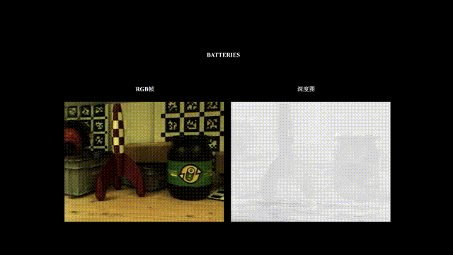

# REG-NeRF: An Real Event-Camera Guided Neural Radiance Field for Motion-Robust 3D Reconstruction

## Abstract
Autonomous navigation in dynamic environments requires accurate and robust 3D scene reconstruction, particularly under conditions of rapid motion.
However, existing reconstruction methods often struggle with motion blur due to their dependence on idealized, sharp image inputs.
Recent research has demonstrated the potential of event cameras, which are resilient to motion blur and capable of microsecond temporal resolution, in assisting deblurring tasks.
In this paper, we propose REG-NeRF, a novel Neural Radiance Fields (NeRF)-based framework that leverages the complementary strengths of event cameras and blurry RGB images for high-fidelity scene modeling.
Our method fuses high-temporal-resolution event data with low-frame-rate image observations through two complementary deblurring priors: a physics-based Event Double Integration (EDI) model and a learning-based Event-Image Cross-modal Attention (EICA) mechanism.
To further address the inherent noise and nonlinear response characteristics of real-world event data, we incorporate a Kolmogorov-Arnold Network (KAN) parameterized with Radial Basis Functions (RBFs) to model the camera`s local response behavior.
REG-NeRF exhibits resilience to motion blur and low signal-to-noise scenarios, achieving superior reconstruction accuracy in high-speed scenarios.
 

## 📢 News
&#9744; The code and data will be made public once the paper is accepted. Stay tuned!

## Visualization
